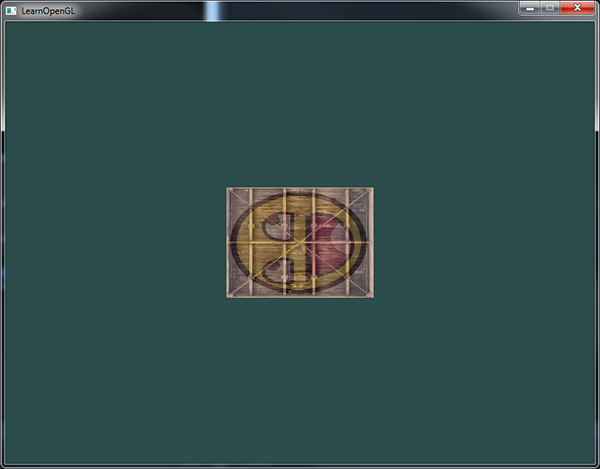

# 变换

尽管我们现在已经知道了如何创建一个物体、着色、加入纹理，给它们一些细节的表现，但因为它们都还是静态的物体，仍是不够有趣。

我们可以尝试着在每一帧改变物体的顶点并且重配置缓冲区从而使它们移动，但这太繁琐了，而且会消耗很多的处理时间。

我们现在有一个更好的解决方案，使用`（多个）矩阵(Matrix)对象`可以更好的`变换(Transform)一个物体`。

当然，这并不是说我们会去讨论武术和数字虚拟世界（译注：Matrix同样也是电影「黑客帝国」的英文名，电影中人类生活在数字虚拟世界，主角会武术）。

矩阵是一种非常有用的数学工具，尽管听起来可能有些吓人，不过一旦你理解了它们后，它们会变得非常有用。在讨论矩阵的过程中，我们需要使用到一些数学知识。对于一些愿意多了解这些知识的读者，我会附加一些资源给你们阅读。

为了深入了解变换，我们首先要在讨论矩阵之前进一步了解一下向量。这一节的目标是让你拥有将来需要的最基础的数学背景知识。如果你发现这节十分困难，尽量尝试去理解它们，当你以后需要它们的时候回过头来复习这些概念。

[Transformations](https://learnopengl-cn.github.io/01%20Getting%20started/07%20Transformations/)

## GLM

GLM是OpenGL Mathematics的缩写，它是一个只有头文件的库，也就是说我们只需包含对应的头文件就行了，不用链接和编译。GLM可以在它们的网站上下载。把头文件的根目录复制到你的includes文件夹，然后你就可以使用这个库了。

> GLM库从0.9.9版本起，默认会将矩阵类型初始化为一个零矩阵（所有元素均为0），而不是单位矩阵（对角元素为1，其它元素为0）。
> 
> 如果你使用的是0.9.9或0.9.9以上的版本，你需要将所有的矩阵初始化改为 glm::mat4 mat = glm::mat4(1.0f)。
> 如果你想与本教程的代码保持一致，请使用低于0.9.9版本的GLM，或者改用上述代码初始化所有的矩阵。

我们需要的GLM的大多数功能都可以从下面这3个头文件中找到：

```c++
#include <glm/glm.hpp>
#include <glm/gtc/matrix_transform.hpp>
#include <glm/gtc/type_ptr.hpp>
```

我们来看看是否可以利用我们刚学的变换知识把一个向量(1, 0, 0)位移(1, 1, 0)个单位（注意，我们把它定义为一个glm::vec4类型的值，齐次坐标设定为1.0）：

```c++
glm::vec4 vec(1.0f, 0.0f, 0.0f, 1.0f);
// 译注：下面就是矩阵初始化的一个例子，如果使用的是0.9.9及以上版本
// 下面这行代码就需要改为:
// glm::mat4 trans = glm::mat4(1.0f)
// 之后将不再进行提示
glm::mat4 trans;
trans = glm::translate(trans, glm::vec3(1.0f, 1.0f, 0.0f));
vec = trans * vec;
std::cout << vec.x << vec.y << vec.z << std::endl;
```

我们先用GLM内建的向量类定义一个叫做vec的向量。

接下来定义一个`mat4`类型的trans，默认是一个`4×4`单位矩阵。

下一步是创建一个变换矩阵，我们是把单位矩阵和一个位移向量传递给`glm::translate`函数来完成这个工作的（然后用给定的矩阵乘以位移矩阵就能获得最后需要的矩阵）。 

之后我们把向量乘以位移矩阵并且输出最后的结果。

如果你仍记得位移矩阵是如何工作的话，得到的向量应该是`(1 + 1, 0 + 1, 0 + 0)`，也就是`(2, 1, 0`)`。

这个代码片段将会输出`210`，所以这个位移矩阵是正确的。

我们来做些更有意思的事情，让我们来旋转和缩放之前教程中的那个箱子。

首先我们把箱子逆时针旋转90度。然后缩放0.5倍，使它变成原来的一半大。我们先来创建变换矩阵：

```c++
glm::mat4 trans;
trans = glm::rotate(trans, glm::radians(90.0f), glm::vec3(0.0, 0.0, 1.0));
trans = glm::scale(trans, glm::vec3(0.5, 0.5, 0.5));
```

首先，我们把箱子在每个轴都缩放到`0.5`倍，然后沿`z轴`旋转`90`度。

GLM希望它的角度是弧度制的(Radian)，所以我们使用`glm::radians`将角度转化为弧度。

注意有纹理的那面矩形是在`XY`平面上的，所以我们需要把它绕着`z`轴旋转。

因为我们把这个矩阵传递给了GLM的每个函数，**GLM会自动将矩阵相乘**，返回的结果是一个包括了多个变换的变换矩阵。

下一个大问题是：如何把矩阵传递给着色器？我们在前面简单提到过GLSL里也有一个`mat4`类型。

所以我们将修改顶点着色器让其接收一个`mat4`的`uniform`变量，然后再用矩阵`uniform`乘以位置向量：

```glsl
#version 330 core
layout (location = 0) in vec3 aPos;
layout (location = 1) in vec2 aTexCoord;

out vec2 TexCoord;

uniform mat4 transform;

void main()
{
    gl_Position = transform * vec4(aPos, 1.0f);
    TexCoord = vec2(aTexCoord.x, 1.0 - aTexCoord.y);
}
```

> GLSL也有`mat2`和`mat3`类型从而允许了像向量一样的混合运算。
> 
> 前面提到的所有数学运算（像是标量-矩阵相乘，矩阵-向量相乘和矩阵-矩阵相乘）在矩阵类型里都可以使用。
> 
> 当出现特殊的矩阵运算的时候我们会特别说明。

在把位置向量传给`gl_Position`之前，我们先添加一个`uniform`，并且将其与变换矩阵相乘。

我们的箱子现在应该是原来的二分之一大小并（向左）旋转了90度。当然，我们仍需要把变换矩阵传递给着色器：

```c++
unsigned int transformLoc = glGetUniformLocation(ourShader.ID, "transform");
glUniformMatrix4fv(transformLoc, 1, GL_FALSE, glm::value_ptr(trans));
```

我们首先查询uniform变量的地址，然后用有Matrix4fv后缀的glUniform函数把矩阵数据发送给着色器。

+ 第一个参数你现在应该很熟悉了，它是uniform的位置值。
+ 第二个参数告诉OpenGL我们将要发送多少个矩阵，这里是1。
+ 第三个参数询问我们我们是否希望对我们的矩阵进行置换(Transpose)，也就是说交换我们矩阵的行和列。OpenGL开发者通常使用一种内部矩阵布局，叫做列主序(Column-major Ordering)布局。GLM的默认布局就是列主序，所以并不需要置换矩阵，我们填GL_FALSE。
+ 最后一个参数是真正的矩阵数据，但是GLM并不是把它们的矩阵储存为OpenGL所希望接受的那种，因此我们要先用GLM的自带的函数value_ptr来变换这些数据。

我们创建了一个变换矩阵，在顶点着色器中声明了一个uniform，并把矩阵发送给了着色器，着色器会变换我们的顶点坐标。最后的结果应该看起来像这样：



完美！我们的箱子向左侧旋转，并是原来的一半大小，所以变换成功了。

我们现在做些更有意思的，看看我们是否可以让箱子随着时间旋转，我们还会重新把箱子放在窗口的右下角。

要让箱子随着时间推移旋转，我们必须在游戏循环中更新变换矩阵，因为它在每一次渲染迭代中都要更新。

我们使用GLFW的时间函数来获取不同时间的角度：

```c++
glm::mat4 trans;
trans = glm::translate(trans, glm::vec3(0.5f, -0.5f, 0.0f));
trans = glm::rotate(trans, (float)glfwGetTime(), glm::vec3(0.0f, 0.0f, 1.0f));
```

要记住的是前面的例子中我们可以在任何地方声明变换矩阵，但是现在我们必须在每一次迭代中创建它，从而保证我们能够不断更新旋转角度。

这也就意味着我们不得不在每次游戏循环的迭代中重新创建变换矩阵。

通常在渲染场景的时候，我们也会有多个需要在每次渲染迭代中都用新值重新创建的变换矩阵

在这里我们先把箱子围绕原点(0, 0, 0)旋转，

之后，我们把旋转过后的箱子位移到屏幕的右下角。

记住，实际的变换顺序应该与阅读顺序相反：尽管在代码中我们先位移再旋转，实际的变换却是先应用旋转再是位移的。

明白所有这些变换的组合，并且知道它们是如何应用到物体上是一件非常困难的事情。

只有不断地尝试和实验这些变换你才能快速地掌握它们。

一个位移过的箱子，它会一直转，一个变换矩阵就做到了！现在你可以明白为什么矩阵在图形领域是一个如此重要的工具了。我们可以定义无限数量的变换，而把它们组合为仅仅一个矩阵，如果愿意的话我们还可以重复使用它。在着色器中使用矩阵可以省去重新定义顶点数据的功夫，它也能够节省处理时间，因为我们没有一直重新发送我们的数据（这是个非常慢的过程）。